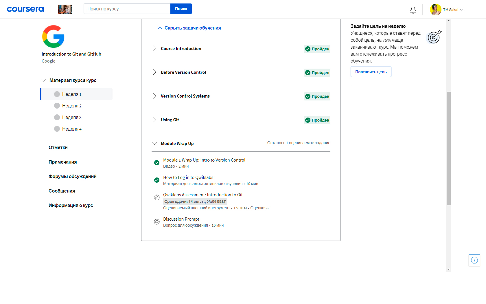

# Kottans-frontend
___
_Всем привет, меня зовут Сергей, я из Украины и я только начинаю учить ___frontend___. В первую очередь я хочу поблагодарить вас за такую возможность, возможность пройти ваш курс бесплатно. Так же я извиняюсь за свой русский, если это не проблема, то я продолжу описывать свои уроки на русском, поскольку с украинским у меня не все так просто, а английский я только вот недавно начал изучать._

___P.S. Слава Україні - героям слава!___
___
Было очень интересно изучать __Git__ и __GitHub__.

На видео курсах первой и второй недели __Coursera__, а так же на практических занятиях сайта [https://learngitbranching.js.org/](https://learngitbranching.js.org/) я узнал много интересного:

* сейчас для меня все в новинку. Сам __Git__ - является для меня чем-то новым,неизведанным. Но все же, допустим команда __git init__, команда с помощью которой я научился создавать репозиторий на своем компьютере
* удивила команда __git cherry-pick__
* __git init, git clone, git status__ - их, и многие другие я буду точно использовать в будущем

<strong>Coursera weeks</strong>

<<<<<<< HEAD

<strong>Learngitbranching tasks</strong>

=======

<strong>Learngitbranching tasks</strong>

>>>>>>> c088aad8525b631377b8876f12f068573d0bef98
